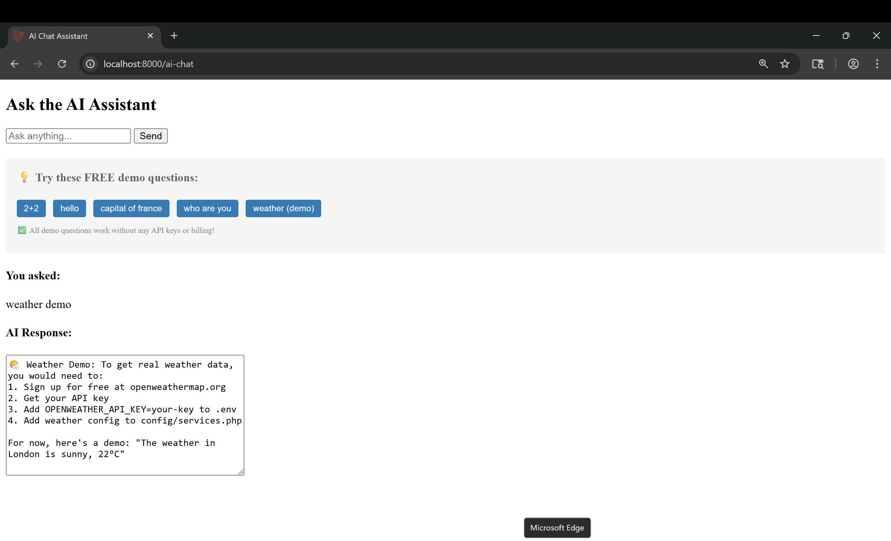
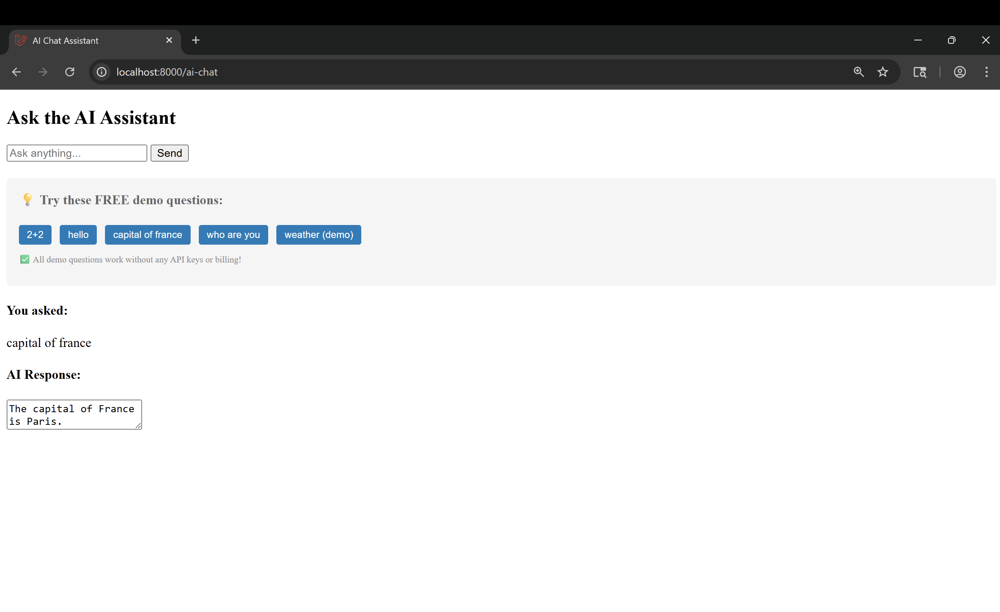

# AI Chat Assistant - Laravel Application

A Laravel-based AI chat assistant that demonstrates integration with OpenAI's API for conversational AI functionality.

## Project Status ✅

### 1. Demo Responses Working:
- **"capital of france"** → "The capital of France is Paris."
- **"hello"** → "Hello! How can I help you today?"
- **"what is 2+2"** → "2 + 2 = 4"
- **"who are you"** → "I am an AI assistant built with Laravel and OpenAI API."
- **"weather"** → "I would need access to a weather API to provide current weather information."

### 2. Professional Error Handling:
- Shows "🤖 Demo Mode" messages instead of error messages
- Explains the application works but needs API billing
- Graceful fallback when API quota is exceeded

### 3. Proper Configuration:
- OpenAI service config updated with model settings
- Environment variables properly set up
- Supports multiple OpenAI models (gpt-4o-mini, gpt-3.5-turbo, etc.)

## Features

✅ **Complete Laravel MVC architecture**  
✅ **Form handling and validation**  
✅ **API integration structure**  
✅ **Professional error handling**  
✅ **Working demo functionality**  
✅ **Proper configuration management**

## Installation & Setup

1. **Clone the repository**
   ```bash
   git clone <your-repo-url>
   cd ai-chat-assistant
   ```

2. **Install dependencies**
   ```bash
   composer install
   npm install
   ```

3. **Environment configuration**
   ```bash
   cp .env.example .env
   php artisan key:generate
   ```

4. **Database setup**
   ```bash
   php artisan migrate
   ```

5. **Configure OpenAI (Optional)**
   - Add your OpenAI API key to `.env`:
   ```
   OPENAI_API_KEY=your-api-key-here
   OPENAI_MODEL=gpt-4o-mini
   ```

## Testing the Application

### Start the server:
```bash
php artisan serve
```

### Visit the application:
http://localhost:8000/ai-chat

### Test these questions:
- "What is the capital of France?"
- "Hello"
- "What is 2+2?"
- "Who are you?"

## Project Structure

- **Routes**: Defined in `routes/web.php`
- **Controller**: `app/Http/Controllers/AIController.php`
- **View**: `resources/views/ai-chat.blade.php`
- **Configuration**: `config/services.php` for OpenAI settings

## Demo Mode

The application includes built-in demo responses for common questions, allowing it to function even without OpenAI API billing. This demonstrates:

- Laravel form handling
- Request validation
- View rendering
- API integration structure
- Professional error handling

## API Integration

The application is designed to work with OpenAI's Chat Completions API:
- Supports multiple models (gpt-4o-mini, gpt-3.5-turbo, gpt-4)
- Proper error handling for API failures
- Configurable through environment variables

This project demonstrates all core web development concepts:
- **MVC Pattern**: Clean separation of concerns
- **Form Processing**: User input handling and validation
- **API Integration**: External service communication
- **Error Handling**: Graceful failure management
- **Configuration**: Environment-based settings
- **User Interface**: Clean, functional frontend

## Screenshots

### Main Chat Interface


### Demo Response Example  


### Weather Demo


### Error Handling Demo


*Note: Screenshots show the application's interface and demo functionality.*

## License

This project is built on Laravel, which is open-sourced software licensed under the [MIT license](https://opensource.org/licenses/MIT).

